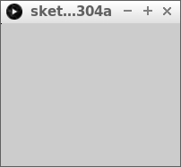
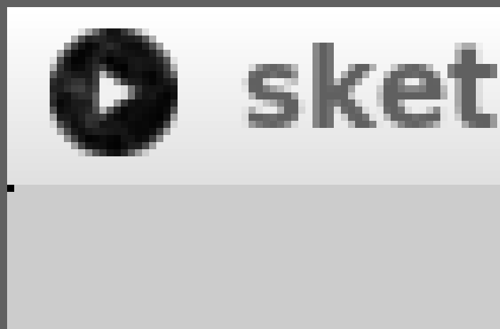
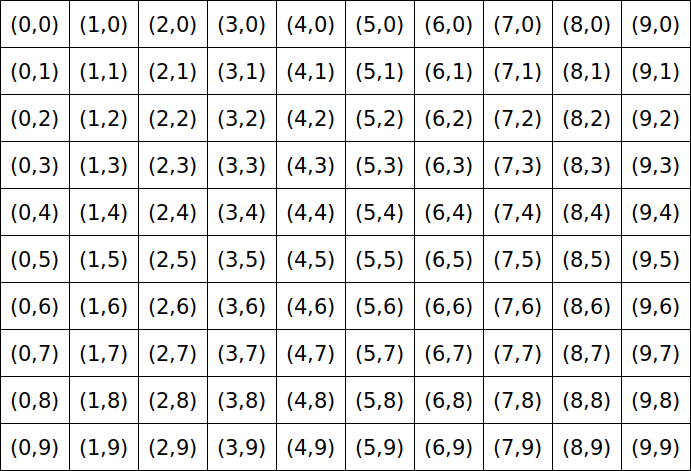

# Point

Processing is een programmeertaal ontwikkeld voor kunstenaars
en erg geschikt om games en mooie dingen mee te maken.

In deze les gaan we leren 

 * wat pixels zijn
 * hoe de pixels op een beeldscherm zitten
 * hoe je puntjes tekent

Zo gaat het eruit zien:


## Pixels

Pixels zijn de vierkantjes waaruit je beeldscherm is opgebouwd.
Hoe meer pixels je scherm heeft, hoe scherper het beeld eruit ziet.
Dat zie je goed bij oude games: die hebben minder pixels:

</img>

## Hoe zitten pixels op je beeldscherm

Elke pixel op je beeldscherm heeft een soort adres. Dit
adres noemen we een coordinaat. Een coordinaat bestaat uit
twee getallen. 

De pixel linksbovenin heeft als coordinaat `(0,0)`.
`(0,0)` spreek je uit als `nul komma nul`.

## Een puntje tekenen

Hier zie je code om een puntje te tekenen:


```
void setup()
{
  size(200,160);
}

void draw()
{
  point(0,0);
}
```

Op het scherm ziet dit er zo uit:



Als je goed kijkt zie je linksbovenin een zwart puntje.
Als we inzoomen, zien we het beter:



De zwarte stip is de pixel die we hebben getekent!

## Opdrachten

 * 1. Wat doet `size(200,160)` ook alweer?
 * 2. Verander `point(0,0)` naar `point(1,0)` en run het programma. Wat zie je?
 * 3. Verander `point(0,0)` naar `point(0,1)` en run het programma. Wat zie je?
 * 4. Wat betekent het eerste getal van een coordinaat?
 * 5. Wat betekent het tweede getal van een coordinaat?

## Oplossing

 * 1. Daarmee maak je het venster 200 pixels breed en 160 pixels hoog
 * 2. Het puntje verschuift een pixel naar rechts
 * 3. Het puntje verschuift een pixel omlaag
 * 4. Het eerste getal van een coordinaat bepaalt hoeveel pixels naar *rechts* het puntje wordt getekent
 * 5. Het tweede getal van een coordinaat bepaalt hoeveel pixels naar *onder* het puntje wordt getekent

## Coordinaten

Een beeldscherm heeft veel coordinaten.
In dit plaatje zie je de coordinaten van de pixels linksbovenin het scherm:

 

Dan zie je dat het eerste getal is hoeveel pixels naar recht hiervan is. Zo zit `(1,0)` 
rechts van `(0,0)`. Het tweede getal is hoeveel pixels je onder `(0,0)` zit. Zo zit `(0,1)` onder `(0,0)`. 

Op deze manier kun je elke pixel op je beeldscherm vinden.

## Vragen

 * Welke coordinaten heb je nodig om een horizontale lijn te tekenen, die
   door `(0,0)` gaat en drie pixels lang is?
 * Welke coordinaten heb je nodig om een vertical lijn te tekenen, die
   door `(1,0)` gaat en drie pixels hoog is?
 * Welke coordinaten heb je nodig om een diagonale lijn te tekenen, die
   door `(0,0)` gaat en drie pixels lang is?
 * Welke coordinaten heb je nodig om een vierkantje te tekenen, die
   door `(0,0)` gaat, twee pixels breed en twee pixels breed is?

## Puntjes tekenen

Dit is de programmeercode die je nodig hebt:

```
void setup()
{
  size(10,10);  
}

void draw() 
{
  //   0123456789
  // 0 ..........
  // 1 ..XXXXXX..
  // 2 .X......X.
  // 3 .X.X..X.X.
  // 4 .X......X.
  // 5 .X.X.X..X.
  // 6 .X..X...X.
  // 7 .X......X.
  // 8 ..XXXXXX..
  // 9 ..........

  
  // Bovenkant hoofd
  point(2,1);  
  point(3,1);  
  point(4,1);  
  point(5,1);  
  point(6,1);  
  point(7,1);  

  // Rechterkant hoofd
  point(8,2);  
  point(8,3);  
  point(8,4);  
  point(8,5);  
  point(8,6);  
  point(8,7);  

  // Onderkant hoofd
  point(2,8);  
  point(3,8);  
  point(4,8);  
  point(5,8);  
  point(6,8);  
  point(7,8);  

  // Linkerkant hoofd
  point(1,2);  
  point(1,3);  
  point(1,4);  
  point(1,5);  
  point(1,6);  
  point(1,7);  

  // Ogen
  point(3,3);
  point(6,3);

  // Mond
  point(3,5);
  point(4,6);
  point(5,5);

}
```

Dit is wat de code doet:

 * `void setup() {}`: de setup functie, de computer voert een keer alles tussen de accolades uit
 * `size(10, 10)`: maak een scherm van 10 pixels breed en 10 pixels hoog
 * `;`: de puntkomma geeft in Processing het einde aan van een zin. Dit is
   ongeveer hetzelfde met een punt in schrijftaal.
 * `void draw() {}`: de draw functie, de computer voert steeds alles tussen de accolades uit
 * `//`: commentaar: de rest van de regel wordt niet gelezen door de 
   computer. Hier kun je dingen neerzetten die speciaal bedoelt zijn 
   voor mensen, zoals jezelf. In dit programma zie je dat het poppetje is
   getekent in commentaar, met de coordinaten aan de zijkant. Ook zie je
   dat de programmeur zegt wat er getekend wordt: zo kun je de fouten sneller
   vinden  
 * `point(2,1)`: teken een puntje op coordinaat (2,1).

## Vragen

 * Start Processing. Kopieer deze code en run het programma
 * Laat de smiley een pixel breeder lachen
 * Draai de lach verticaal om, zodat de smiley sip gaat kijken
 * Geef de smiley punk haar door drie pixels bovenop het hoofd erbij te tekenen
 * Geef de smiley een sik van een pixel

## Oplossing

```
void setup()
{
  size(10,10);  
}

void draw() 
{
  //   0123456789
  // 0 ..X.X..X..
  // 1 ..XXXXXX..
  // 2 .X......X.
  // 3 .X.X..X.X.
  // 4 .X......X.
  // 5 .X..XX..X.
  // 6 .X.X..X.X.
  // 7 .X......X.
  // 8 ..XXXXXX..
  // 9 ....X.....


  // Bovenkant hoofd
  point(2,1);  
  point(3,1);  
  point(4,1);  
  point(5,1);  
  point(6,1);  
  point(7,1);  

  // Rechterkant hoofd
  point(8,2);  
  point(8,3);  
  point(8,4);  
  point(8,5);  
  point(8,6);  
  point(8,7);  

  // Onderkant hoofd
  point(2,8);  
  point(3,8);  
  point(4,8);  
  point(5,8);  
  point(6,8);  
  point(7,8);  

  // Linkerkant hoofd
  point(1,2);  
  point(1,3);  
  point(1,4);  
  point(1,5);  
  point(1,6);  
  point(1,7);  

  // Ogen
  point(3,3);
  point(6,3);

  // Mond
  point(3,6);
  point(4,5);
  point(5,5);
  point(6,6);

  // Punkhaar
  point(2,0);  
  point(4,0);  
  point(7,0);  

  // Sik
  point(9,4);
}
```

## Eindopdracht


Hier zie je een uitvergroot plaatje. Maak deze in het klein na met pixels.
